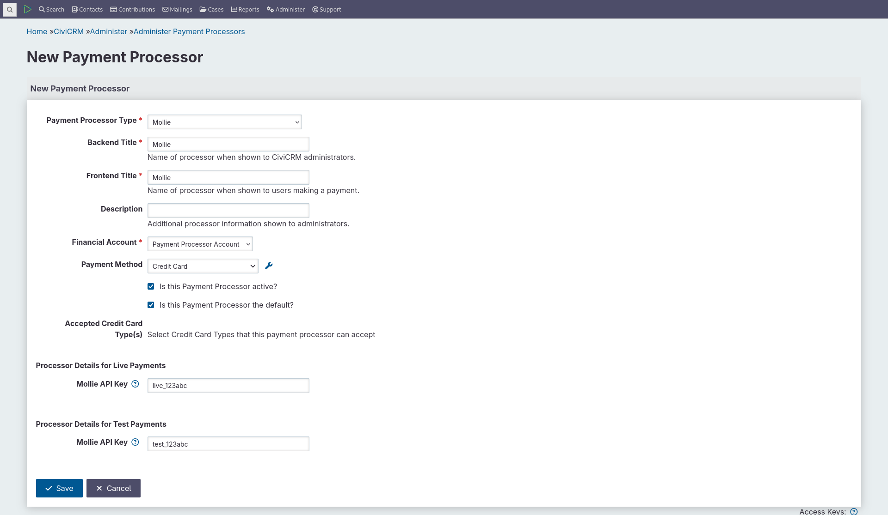
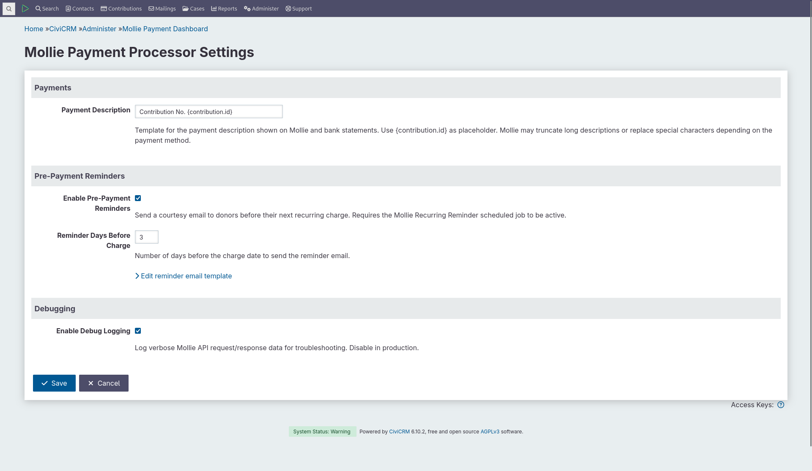
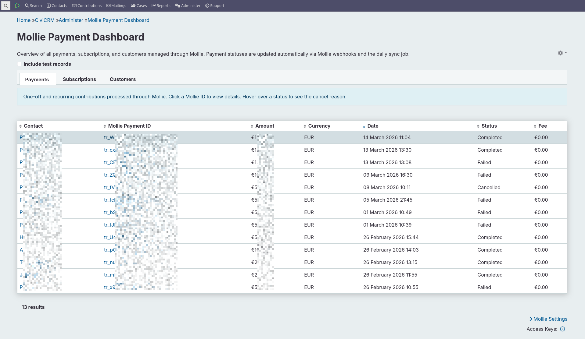
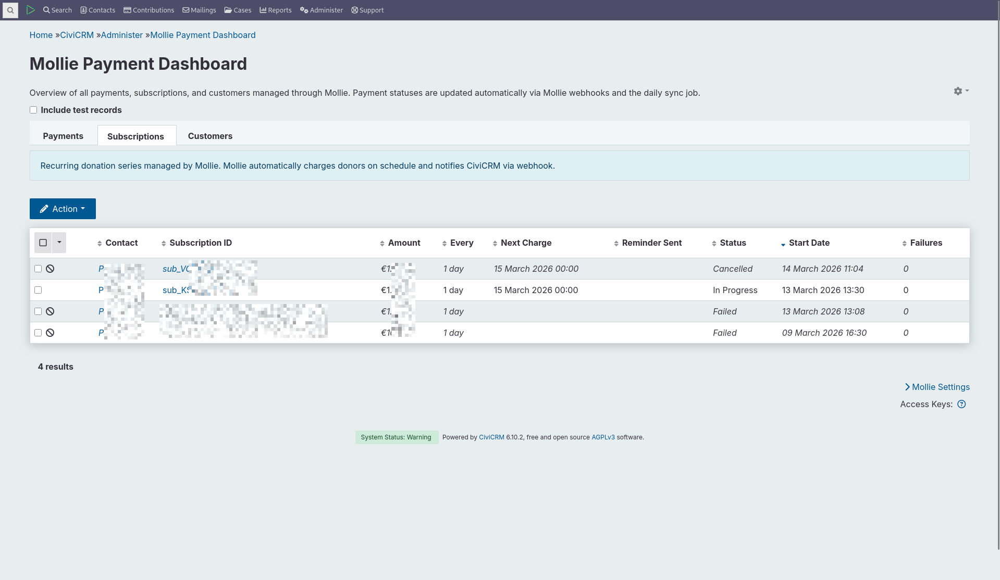
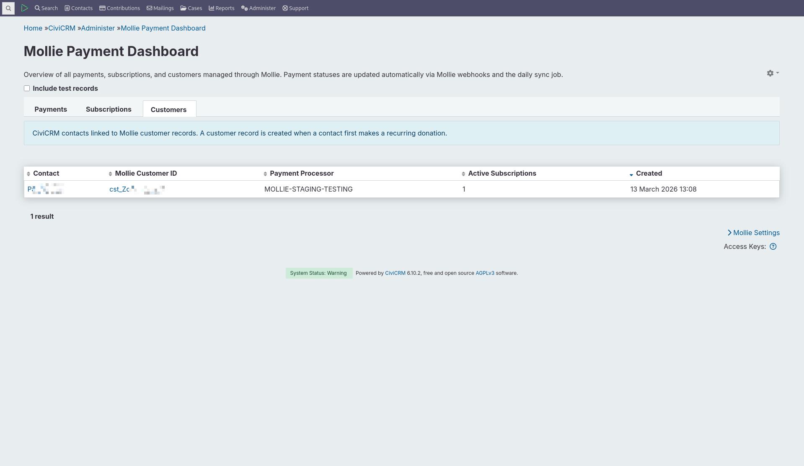
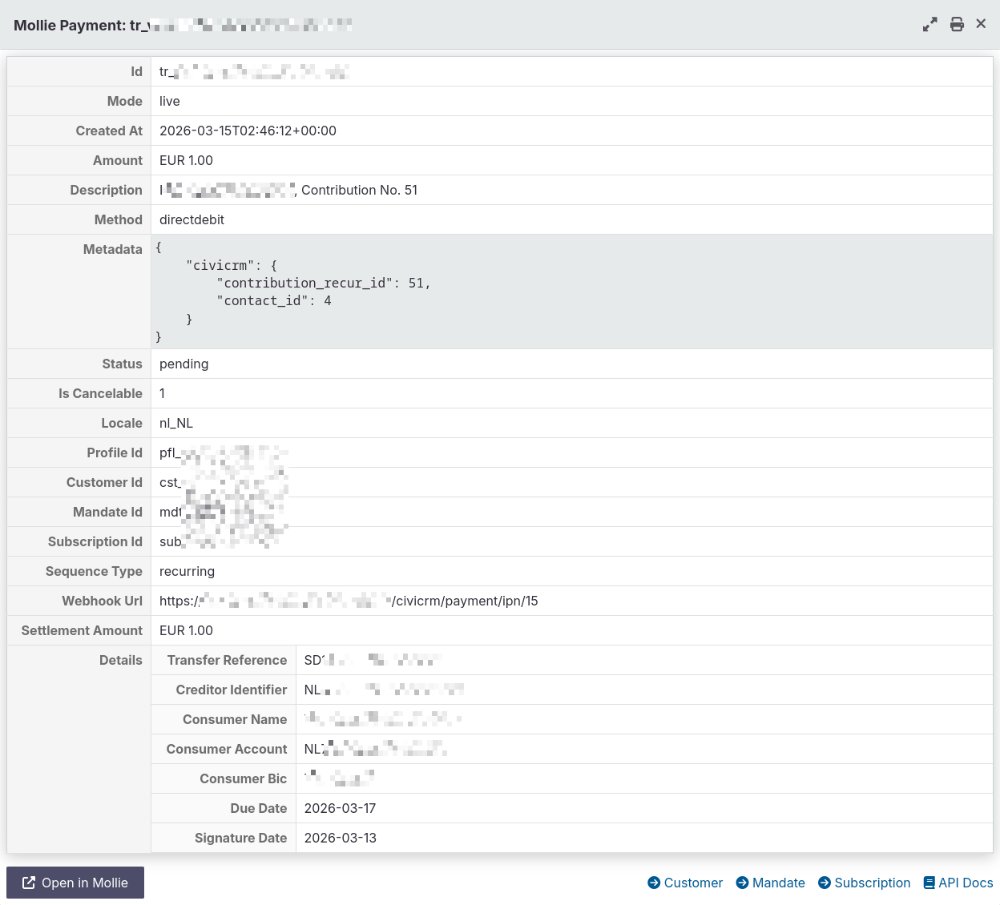
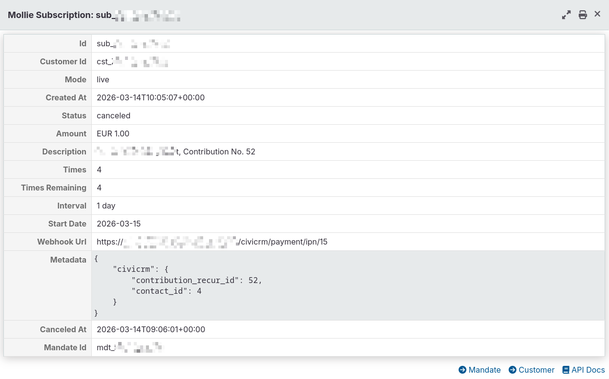
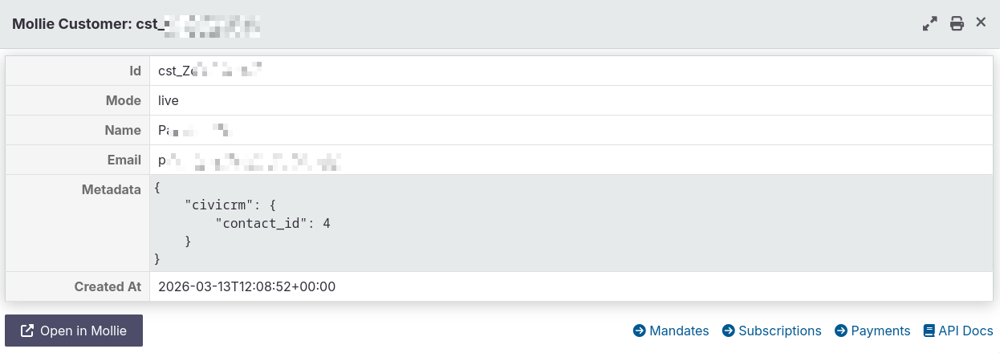
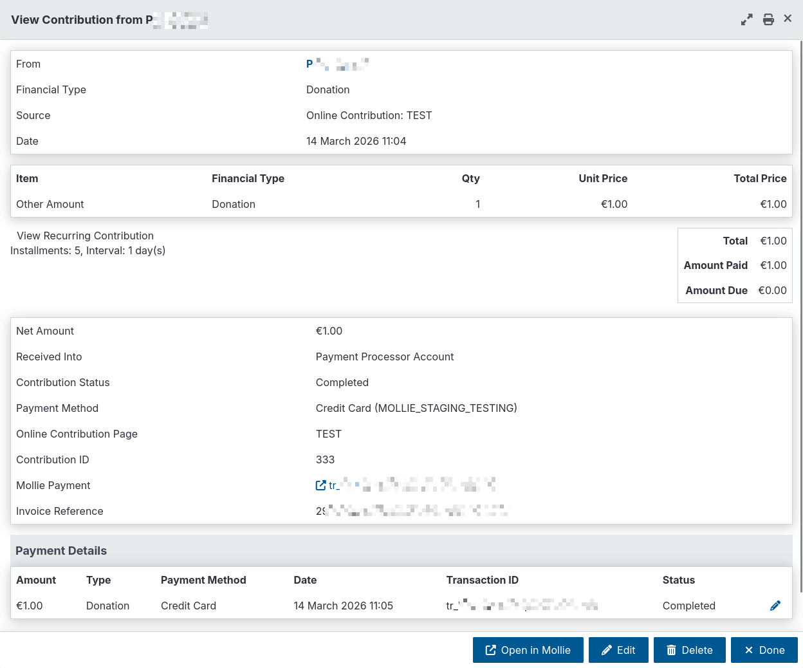
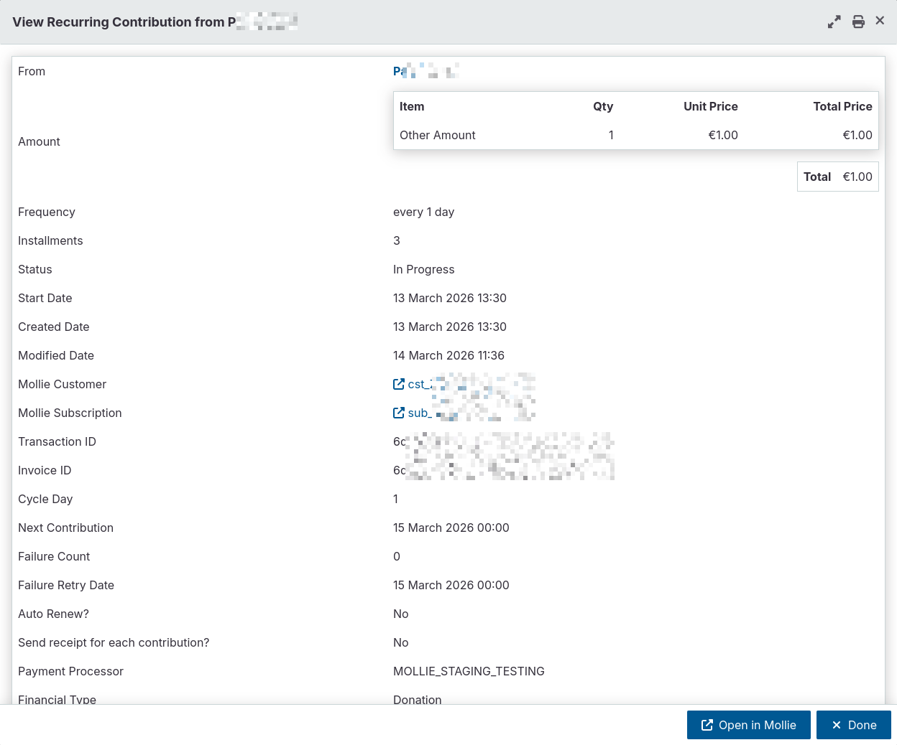

# Mollie Payment Processor for CiviCRM

A CiviCRM extension for processing one-off and recurring contributions through [Mollie](https://mollie.com).

**Extension key**: `com.passionate-bytes.mollie`

## Requirements

- CiviCRM >= 6.0
- PHP >= 8.1
- A [Mollie](https://mollie.com) account with API keys
- A [cron job](https://docs.civicrm.org/sysadmin/en/latest/setup/jobs/) configured for CiviCRM scheduled jobs
- For recurring contributions via iDEAL: SEPA Direct Debit must be enabled in your Mollie account

## Features

- **One-off contributions** — redirect-based payments via Mollie's hosted checkout
- **Recurring contributions** — automatic scheduling and charging via Mollie's Subscriptions API
- **Webhook-driven status updates** — payment state is always verified against Mollie's API, never based on redirect returns
- **Pre-payment reminders** — optional email notifications before upcoming recurring charges
- **Admin dashboard** — SearchKit-based overviews of payments, subscriptions, and customers
- **Daily sync job** — fallback to keep CiviCRM in sync with Mollie when webhooks don't reach CiviCRM (e.g., server downtime, network issues)
- **Recurring lifecycle management** — cancel subscriptions and change amounts from within CiviCRM
- **Test mode** — full support for Mollie test API keys

### Supported Frequencies

| Frequency      | Mollie Interval |
| -------------- | --------------- |
| Every N days   | `N days`        |
| Every N weeks  | `N weeks`       |
| Every N months | `N months`      |
| Yearly         | `12 months`     |

## Installation

1. Copy or clone this extension into your CiviCRM extensions directory (e.g., `sites/default/files/civicrm/ext/`). All dependencies are bundled.
2. Enable the extension via **Administer > System Settings > Extensions**.

### Upgrading

1. Replace the extension files in your extensions directory with the new version.
2. Navigate to **Administer > System Settings > Extensions** and run any pending database upgrades if prompted.
3. Managed entities (scheduled jobs, saved searches, message templates) are updated automatically. Customizations to the editable reminder email template are preserved.

### Uninstalling

Disable and uninstall the extension via **Administer > System Settings > Extensions**. This removes:

- The `civicrm_mollie_customer` table (Mollie customer ID mappings)
- Managed entities (scheduled jobs, saved searches, option values, navigation items)

Existing contributions, recurring contributions, and payment tokens are **not deleted** — they remain in CiviCRM as standard financial records. Active Mollie subscriptions are **not cancelled** — cancel them manually in the Mollie dashboard or via CiviCRM before uninstalling.

## Configuration

### Payment Processor Setup

1. Go to **Administer > CiviContribute > Payment Processors**.
2. Click **Add Payment Processor** and select **Mollie** as the processor type.
3. Enter your Mollie API keys:
   - **Live API Key** — your Mollie live key (starts with `live_`)
   - **Test API Key** — your Mollie test key (starts with `test_`)
4. Save the payment processor.

CiviCRM's built-in test/live mode toggle determines which key is used at runtime.

**Test mode note**: Mollie's test environment supports one-off payments and first recurring payments. However, Mollie does not automatically trigger subsequent subscription charges in test mode — those can only be verified with live payments. See [Mollie's testing guide](https://docs.mollie.com/overview/testing) for details.

### Extension Settings

Extension settings are available at **Administer > CiviContribute > Mollie Settings** (`civicrm/admin/mollie/settings`):

| Setting                      | Default                       | Description                                          |
| ---------------------------- | ----------------------------- | ---------------------------------------------------- |
| Payment Description          | `Donation #{contribution.id}` | Template for bank statement descriptions             |
| Enable Pre-Payment Reminders | Off                           | Send email reminders before recurring charges        |
| Reminder Days Before Charge  | 7                             | How many days before the charge to send the reminder |
| Enable Debug Logging         | Off                           | Verbose Mollie API logging (disable in production)   |

### Contribution Pages

Once the payment processor is configured, assign it to your contribution pages under **Manage Contribution Pages > Amounts Tab**. Enable the "Recurring contributions" option on the page if you want to accept recurring contributions.

## How It Works

For detailed payment flow sequences, see the [Payment Flows](DEVELOPMENT.md#payment-flows) section in the development guide.

### One-Off Contributions

1. Contact fills out a CiviCRM contribution page and submits.
2. The contact is redirected to Mollie's hosted payment page.
3. After completing (or cancelling) the payment, the contact returns to CiviCRM.
4. Mollie sends a webhook to CiviCRM with the payment result — this is what actually updates the contribution status, not the redirect.

### Recurring Contributions

1. Contact selects a recurring option on the contribution page and completes the first payment on Mollie.
2. The first payment establishes a mandate (authorization for future charges).
3. Once the first payment succeeds, a Mollie subscription is automatically created.
4. Mollie handles all subsequent charges on schedule — CiviCRM does not trigger them.
5. Each charge triggers a webhook that creates a new contribution in CiviCRM.

### Chargebacks and Refunds

The extension automatically handles chargebacks and refunds initiated through Mollie. When Mollie notifies CiviCRM of a chargeback or refund, the extension:

- Records the reversal as a negative payment for proper financial bookkeeping
- Updates the contribution status (Chargeback, Refunded, or Partially paid)
- Attaches a Note to the contribution with details (amount, date, reason) for staff reference

No manual action is required — chargebacks and refunds processed through Mollie are reflected in CiviCRM automatically.

### Pre-Payment Reminders

When enabled, a daily scheduled job checks for upcoming recurring charges and sends reminder emails to contacts within the configured window (default: 7 days before). The email template can be customized via **Mailings > Message Templates > System Workflow Messages** (look for "Mollie Recurring Reminder").

The template uses custom `{contribution_recur.*}` tokens provided by this extension, as well as standard CiviCRM tokens like `{contact.*}` and `{domain.*}`. Customizations to the editable template are preserved across extension upgrades. See the [Email Templates](DEVELOPMENT.md#email-templates) section in the development guide for the full token reference.

## Admin Dashboard

An admin dashboard is available at **Administer > CiviContribute > Mollie Payment Dashboard** (`civicrm/admin/mollie`) with three views:

- **Payments** — all Mollie-processed contributions with payment ID, method, status, and fees
- **Subscriptions** — active recurring contributions with Mollie subscription status, next charge date, and mandate type
- **Customers** — Mollie customer mappings to CiviCRM contacts

Clicking a Mollie ID opens a detail modal that fetches live data from the Mollie API, showing the full resource with navigation between related resources.

### Detail Modals

Detail modals display the complete Mollie resource data (payment, subscription, customer, mandate, refund, etc.) with an "Open in Mollie" button linking to the Mollie dashboard and links to related resources.

### Mollie Details on CiviCRM Views

Mollie-specific information is also injected into CiviCRM's standard Contribution and Recurring Contribution detail views, with clickable links to the detail modals and direct links to the Mollie dashboard.

## Scheduled Jobs

The extension registers two scheduled jobs that run daily. Verify they are enabled under **Administer > System Settings > Scheduled Jobs**.

### MollieSync

Fallback sync that fetches subscription and contribution statuses from Mollie to keep CiviCRM up to date when webhooks fail to arrive (e.g., due to server downtime or network issues). Specifically, it:

- Checks all active/pending recurring contributions with a Mollie subscription
- Syncs status, next charge date, and amount from Mollie into CiviCRM (Mollie is the source of truth)
- Detects completed, cancelled, and suspended subscriptions and updates the recurring contribution accordingly
- Retries cancellations that were made in CiviCRM but failed to reach Mollie (e.g., due to a network error at the time)

### MollieRecurringReminder

Sends pre-payment reminder emails before upcoming recurring charges (only active when enabled in extension settings). Specifically, it:

- Finds recurring contributions with a next charge date within the configured reminder window
- Sends a reminder email to each contact using the "Mollie Recurring Reminder" workflow message template
- Records a "Mollie Reminder Sent" activity on the contact to prevent duplicate reminders for the same billing cycle

## Permissions

This extension uses standard CiviCRM permissions — no custom permissions are defined.

| Component                  | Required Permission             |
| -------------------------- | ------------------------------- |
| Payment Dashboard          | `access CiviContribute`         |
| Extension Settings         | `administer payment processors` |
| MollieCustomer API (read)  | `access CiviContribute`         |
| MollieCustomer API (write) | `administer payment processors` |

All search displays respect CiviCRM's standard contact and contribution ACLs.

The webhook endpoint is unauthenticated by design — Mollie calls it server-to-server, and the handler always verifies payment status by fetching the full payment object from Mollie's API. See the [Webhook Security](DEVELOPMENT.md#webhook-security) section in the development guide for details.

## Troubleshooting

### Payments stay in "Pending" status

Mollie cannot reach the webhook URL. Verify that your CiviCRM instance is publicly accessible and that no firewall rules block incoming POST requests to the webhook endpoint. The daily MollieSync job will eventually catch up, but webhooks should be the primary mechanism.

### Recurring contributions fail on the second charge

SEPA Direct Debit is likely not enabled in your Mollie account. iDEAL-based recurring contributions use SEPA DD for subsequent charges. Enable it in your Mollie dashboard.

### Unmatched webhook payments

If a Mollie webhook arrives for a payment that cannot be matched to a CiviCRM contribution or recurring contribution, the extension creates an "Unmatched Mollie Payment" activity with details from the Mollie payment object. Check **Activities** for these if you suspect missed or orphaned payments.

### Debug logging

Enable **Debug Logging** in the extension settings to log detailed Mollie API request/response data. Logs are written to CiviCRM's log system under the `mollie` channel. **Disable this in production** as it produces verbose output.

### CMS Compatibility

This extension has been developed and tested on **CiviCRM Standalone**. It uses only standard CiviCRM APIs and hooks, so there should be no compatibilityu issues on Drupal, WordPress, Joomla, and Backdrop. - But these have not been tested yet. If you're running this extension on a different CMS, please [report any issues](https://github.com/PassionateBytes/civicrm-mollie/issues).

## Development & Architecture Details

See [DEVELOPMENT.md](DEVELOPMENT.md) for architecture details, design decisions, and developer workflow.

## License

AGPL-3.0 — see [LICENSE](LICENSE).

## Credits

Developed by **Paul Bütof** ([Passionate Bytes Solutions](https://www.passionate-bytes.com)) as a volunteering effort for [Stichting GAST](https://www.stichtinggast.nl).
